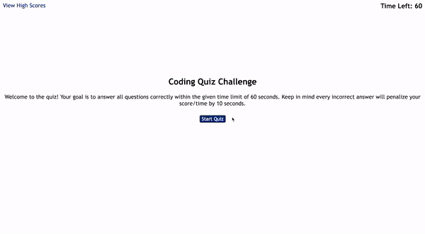

# Module-4-Challenge-Quiz

## Deployed Website

[Quiz](https://yeezyhub.github.io/Module-4-Challenge-Quiz/)

## Description

&nbsp;&nbsp;&nbsp;&nbsp;&nbsp;&nbsp;As I get close to being a full stack developer, I learn a lot of information everyday. To challenge myself and other people with a set of questions, I have created a JavaScript quiz for the people who wants to test their skills and challenge themselves. It helps people to discover new features of JavaScript and be quick at the same time to achieve the highest score possible. This experience helped me to improve my CSS, HTML and JavaScript infrastructure skills for understanding other topics in the future.
## Usage

&nbsp;&nbsp;&nbsp;&nbsp;&nbsp;&nbsp;Welcome to the quiz! Your goal is to answer all questions correctly within the given time limit of 60 seconds. Keep in mind every incorrect answer will penalize your score/time by 10 seconds. The quiz is all about JavaScript knowledge. After you are done with the quiz, put your initials and submit to check where you are located in the high score list. Here is a quick demonstration of quiz website:

## Credits

My Github Profile: [yeezyhub](https://github.com/yeezyhub)

## License

Please refer to the LICENSE in the repo.
